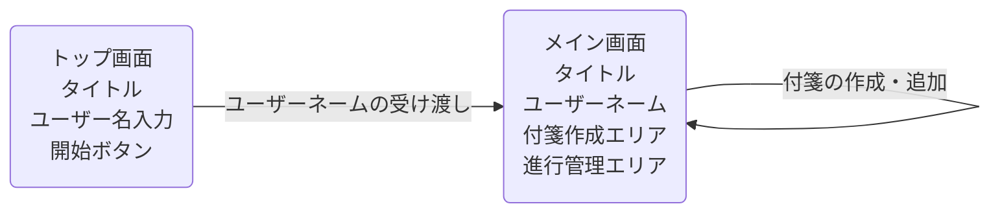

# StickyNote
誰でも気軽に活用できる付箋アプリ(バージョン2.0)
このアプリは、日々の業務開始前にタスクを洗い出し、進捗を視覚的に管理することを目的とした**付箋型タスク管理ツール**です。

## 目的

- 業務効率化（業務漏れ防止・進捗可視化・チーム連携）
- 資源保護（紙の付箋を使わない、デジタル化によるエコ化）

## 想定ユーザー

- 全スタッフ（ITリテラシーを問わず誰でも利用可能）

## 使用シーン

1. 業務開始前にその日のタスクを洗い出す
2. 「着手前」→「進行中」→「完了」の3ステージに付箋を配置・移動
3. 業務中は付箋を更新しながら進捗を管理
4. 日をまたいでデータは保持しない（1日単位でリセット）

## 機能概要

- タスク（付箋）の作成・編集・削除
- ステージ間での付箋の移動
- セッションベースの一時保存（ページを閉じるまで保持）
- シンプルで直感的なUI設計

## 使用技術

- HTML / CSS / JavaScript
- sessionStorage（ローカル保存による簡易記憶）

- Visual Studio Code + Live Server
- Git / GitHub（バージョン管理）

## 画面遷移図

## 今後の拡張（予定）

- PDFやCSVでのタスク出力
- チーム共有や管理者視点での進捗確認機能

## ライセンス

このプロジェクトは学習および業務効率化のための個人開発プロジェクトです。  
必要に応じてカスタマイズしてご利用ください。
